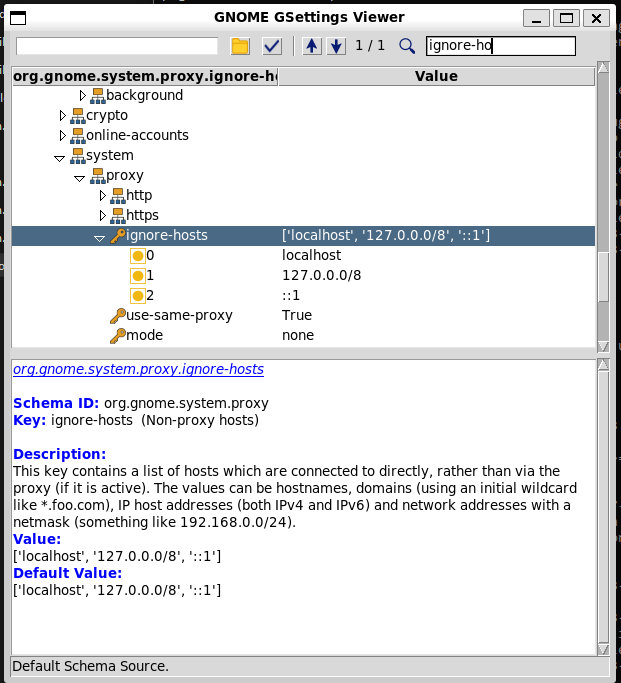

# gsettings_ui
[](https://www.gnu.org/licenses/gpl-3.0.en.html) 
[](https://www.python.org/downloads/)
[]

## Overview
**gsettings_ui** is a Python-based tool for browsing GNOME settings through a user-friendly graphical interface. It aims to simplify the process of viewing gsettings keys without using the command line. Built with Python 3.6+ and Tkinter, this project is suitable for users who want an accessible way to customize their GNOME desktop environment.

## Features
- 🚀 View GNOME settings in a simple UI
- 🔍 Incrementally search keys
- 🛠️ Examine key values, descriptions, defaults, and ranges

## Screenshot


## Installation

1. Clone the repository:
    ```bash
    git clone https://github.com/victor-havin/gsettings-ui.git
    ```

2. Navigate to the directory:
    ```bash
    cd gsettings-ui
    ```

3. Install Python dependencies:
    ```bash
    pip install -r requirements.txt
    ```

4. Install system dependencies (if needed):
    ```bash
    sudo apt install python3-gi
    ```

## Usage

```bash
python3 proto_ui.py
```

---

**Tip:**  
- If you encounter issues with missing icons, the app will use fallback icons.
- Requires GNOME and GSettings schemas available on your system.

---

## License

This project is licensed under the GPL v3.0. See [LICENSE](LICENSE) for details.

